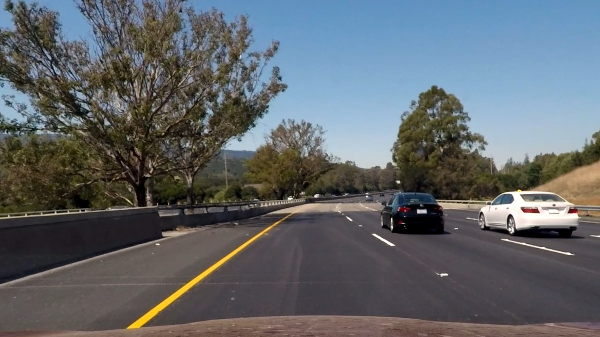
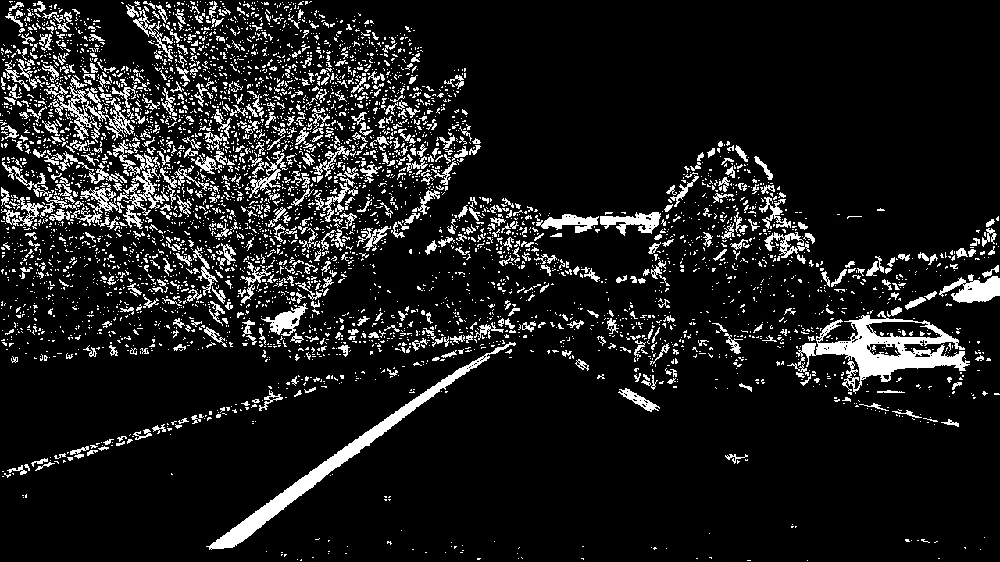

---

**Advanced Lane Finding Project**

---
### README


### Camera Calibration

#### 1. Briefly state how you computed the camera matrix and distortion coefficients. Provide an example of a distortion corrected calibration image.

The code for this part is located in [calibrate.py](./calibrate.py), line:#6-#40. I mainly use `cv2.findChessboardCorners` to find corners to compute the camera calibration. And the calculated `mtx` and `dist` are saved in [camera.p](./camera.p), which can be loaded by calling `loadCalMat()` from `calibrate.py`. Also, `mtx` and `dist` are used to undisort Img by `undisort()` from `calibrate.py`. Results are stored in [./output_images/undisort](./output_images/undisort)

### Pipeline

#### 1. A distortion-corrected image.

#### 2. Describe how (and identify where in your code) you used color transforms, gradients or other methods to create a thresholded binary image.  Provide an example of a binary image result.
I used a combination of color and gradient thresholds to generate a binary image (thresholding steps at lines #8 through #105 in `thresholdBinary.py` and lines #20 through #23 in `pipe.py`).  Here's an example of my output for this step.  (note: this is not actually from one of the `test6.jpg`)
```python
    #Color & Gradient Threshold 
    gradient_binaryImg = gradient_combined(undisImg,ksize=9)
    color_binaryImg = color_combined(undisImg)
    combin_binaryImg = np.zeros_like(gradient_binaryImg)
    combin_binaryImg[(color_binaryImg == 1)|(gradient_binaryImg == 1)] = 1
```



#### 3. Describe how (and identify where in your code) you performed a perspective transform and provide an example of a transformed image.

The code for my perspective transform includes functions called `warpPtsCal()` and `warpImg()`, which are in the file `pipe.py`. I chose the hardcode the source and destination points in the following manner:

```python
    y = img.shape[0]
    x = img.shape[1]
    srcP = np.float32([[x*0.43, y*0.67],     # top left
                     [x*0.58, y*0.67],      # top right
                     [x*0.85, y*0.98],      # bottom right
                     [x*0.17, y*0.98]])     # bottom left
    dstP = np.float32([[200, 0],        # top left
                      [x-200, 0],      # top right
                      [x-200, y],      # bottom right
                      [200, y]])       # bottom left

```

I verified that my perspective transform was working as expected by drawing the `src` and `dst` points onto a test image and its warped counterpart to verify that the lines appear parallel in the warped image.


#### 4. Describe how (and identify where in your code) you identified lane-line pixels and fit their positions with a polynomial?

Then I did some other stuff and fit my lane lines with a 2nd order polynomial kinda like this:


#### 5. Describe how (and identify where in your code) you calculated the radius of curvature of the lane and the position of the vehicle with respect to center.

I did this by `curve_cal()` in lines #326 through #356 in my code in `pipe.py`

#### 6. Provide an example image of your result plotted back down onto the road such that the lane area is identified clearly.

I implemented this step in lines #82 through #106 in my code in `pipe.py` in the function `drawLineOnImg()`.  Here is an example of my result on a test image:


---

### Pipeline (video)

#### 1. Provide a link to your final video output.  Your pipeline should perform reasonably well on the entire project video (wobbly lines are ok but no catastrophic failures that would cause the car to drive off the road!).

Here's a [link to my video result](./videos.mp4). So sorry, it's a little too fast, for I generate it by `videos.py` with fps=60..

---
### Discussion
It's not robust enough, and it's all about threshold tunning. There should be a adaptive threshold value.
